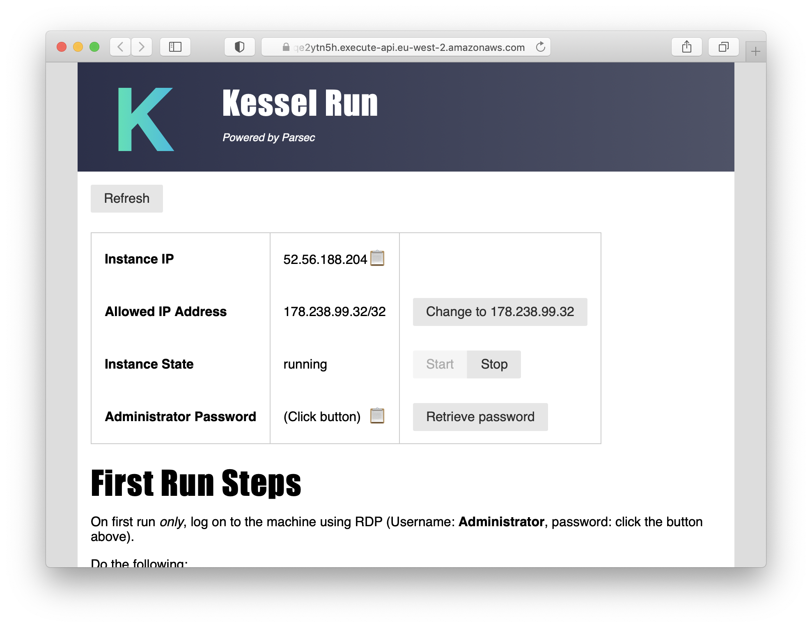

# Kessel Run

I found myself wanting to play *Age of Empires*, but I was on a Mac. What's someone to do?

Run a gaming machine in AWS and stream the game to my laptop, that's what!

# What is it

Use CDK to set up a Cloud Gaming machine in about half an hour. As long as you remember to stop the instance when you no
longer need it, you only pay about $0.50/hour of active use, plus $5/month for the disk storage.



# How to use

You need the following:

* An AWS account
* A [Parsec](https://parsec.app) account (and Parsec installed)
* A Microsoft Remote Desktop Client installed

Configure AWS credentials and configure your default region:

```
# EITHER
$ aws configure

# OR
$ export AWS_ACCESS_KEY_ID=...
$ export AWS_SECRET_ACCESS_KEY=...
$ export AWS_REGION=...
```

Finally, run:

```
$ npx instacdk deploy rix0rrr/kessel-run
```

The command will run for a while, and finally spit out a URL. Visit that URL in your browser to
get the IP address, admin password for initial RDP setup, and start/stop the instance.

To get rid of everything created by this application, run:

```
$ npx instacdk manage
```

Or log in to the CloudFormation console and delete the **KesselRunStack** stack.

# Future improvements

- Authentication to the management page. Right now, keep the URL secret as anyone who has it
  can access your instance!
- Use a small EBS volume to boot from and a larger, cheaper EBS volume (which can even be persisted between instances)
  to store games on.
- Use spot pricing for the instances, saving ~$0.15/hour of active use.
